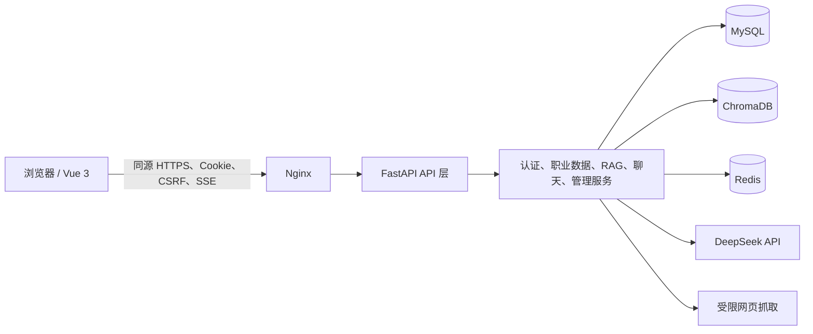
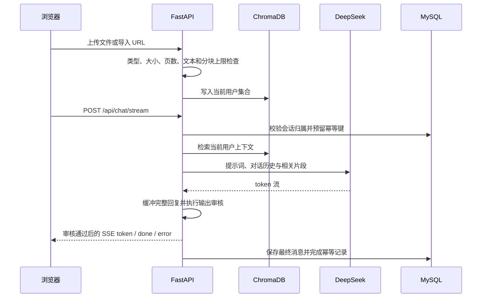
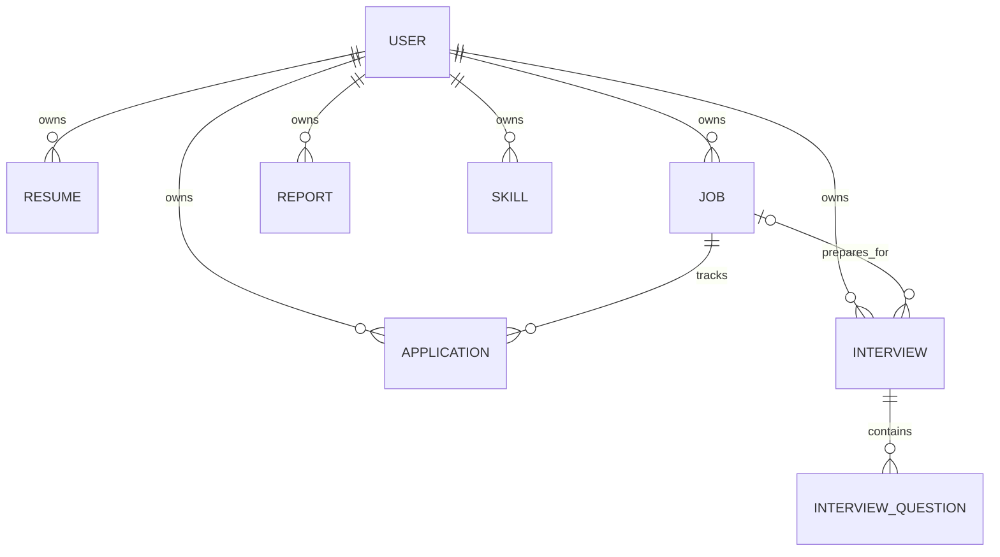
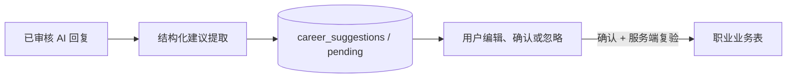

# 职达架构说明

## 架构定位

职达采用模块化单体，而不是微服务。Vue SPA 负责交互，FastAPI 在同一进程中提供认证、业务 API、RAG、模型编排和管理能力；MySQL、ChromaDB 与 Redis 按数据职责拆分。该形态适合当前团队和业务规模，也能避免过早引入分布式事务。

## 层次与职责

| 层次 | 当前职责 | 约束 |
| --- | --- | --- |
| 表现层 | Vue Router、页面、组件、API client、SSE 渲染 | 不使用客户端 `user_id` 作为授权依据；写请求统一携带 CSRF |
| 接入层 | Nginx 静态资源、同源 `/api/` 代理、SSE 超时与缓冲配置 | 生产仅公开 TLS 入口；后端端口保持内网或本机可见 |
| API 层 | FastAPI router、Pydantic 校验、依赖注入、HTTP 状态转换 | router 不直接信任资源归属字段；当前用户来自服务端会话 |
| 业务/服务层 | 认证、权限、职业数据、对话编排、RAG、抓取、限流、管理审计 | 跨资源规则在服务端执行；外部失败转换为稳定的业务错误 |
| 持久化与外部能力 | MySQL、ChromaDB、Redis、DeepSeek、网页 | 每种存储只承担其声明的职责；部署时分别检查和备份 |

代码入口为 `backend/main.py` 和 `frontend/src/main.js`。后端按 `routers/` 与 `services/` 分模块；前端按 `views/`、`components/`、`composables/` 与 `api/` 组织。新增板块应延续模块边界，不继续扩大单个全局组件或通用数据库文件。

## 核心数据流

### 认证与授权

1. 注册或登录成功后，后端写入 HttpOnly `session_token` 和可读 `csrf_token` Cookie。
2. 读取接口验证服务端会话；写接口还比较 `X-CSRF-Token` 与 Cookie。
3. 资源查询始终同时约束当前用户。跨用户资源统一表现为不存在，避免泄露 ID 有效性。
4. 管理接口再执行 `user`、`admin`、`super_admin` 的角色检查，并记录敏感管理操作。

### 文档、RAG 与聊天

非流式与流式聊天都使用 `client_request_id` 防止重试产生重复回复。为避免未审核 token 泄露，后端会先完整缓冲模型回复，通过输出审核后再按 SSE token 协议发送，因此首 token 延迟接近完整生成时间。流式连接仍可能在 HTTP 200 之后通过 SSE `error` 事件报告失败，客户端必须同时处理 HTTP 错误和流内错误。

### 职业数据域

- 简历与岗位保存可复用的结构化上下文。
- 投递必须引用当前用户的岗位；面试可选引用岗位。
- 面试题是面试场次的子资源，记录回答、分数和反馈。
- 报告可选关联简历、岗位、投递、面试或技能；关联对象也必须属于当前用户。结构化 `payload` 的紧凑 JSON UTF-8 编码上限为 256 KiB。
- 技能记录目标层级、状态、进度与计划日期。
- 主简历唯一性由生成列上的唯一索引兜底；投递/面试到岗位的关系使用包含 `user_id` 的复合外键，数据库层也会拒绝跨用户关联。API 删除岗位前会解除面试关联，因此投递随岗位删除，面试历史保留；删除面试才会级联删除面试题。
- 所有职业写操作、职业数据导出和知识库写操作都先获取 MySQL 用户级 advisory lock；这会在多进程/多实例间串行化同一用户的协作请求，避免它们与 `DELETE /api/career/data` 并发。普通读取不持有该锁，锁超时表现为可重试的 `409`。
- `/api/career/export` 导出当前用户的六类职业数据；`DELETE /api/career/data` 清除职业数据与 Chroma 用户集合，但不删除账号、聊天和审计数据。导出不是流式/分页实现，会在后端内存中组装该用户全部记录和面试题；数据量很大时可能增加内存、锁持有时间和超时风险。
- 用户锁不能把 Chroma 与 MySQL 变成分布式原子事务。清空实现先删用户向量集合、再事务删除职业表，失败后可以安全重试；部署方仍须核对 MySQL 与 Chroma 两侧结果，不能仅凭单次 HTTP 结果推断所有副本均已清理。

### AI 职业数据建议

AI 对话完成并通过输出审核后，后端使用独立、无副作用的结构化调用提取最多三条新增建议。建议先绑定 assistant 消息保存到 MySQL；只有用户检查、编辑并确认后，后端才会把数据写入职业业务表。提取超时、模型坏结构或候选校验失败只会得到空建议，不会让正常聊天失败。

- 建议只支持新增六类顶层资源，以及向已有面试原子添加题目批次；不支持修改、删除或跨建议依赖。
- 未确认建议使用 `revision` 做乐观并发；接受时再使用用户 advisory lock、行锁和单个 MySQL 事务完成目标创建与状态变更。
- 面试题的 AI 参考答案和辅导建议使用独立字段；用户真实作答、复盘反馈和分数不由 AI 预填。
- 会话历史和 `client_request_id` 重放返回相同建议 ID。建议提取失败不得重新执行或影响已完成回答。
- 详细产品与状态边界见 [AI 职业数据建议](ai-suggestions.md)。

## 存储边界

| 存储 | 内容 | 一致性与恢复 |
| --- | --- | --- |
| MySQL | 用户、认证会话、聊天、AI 职业建议、反馈、管理审计、职业实体 | 权威业务数据；升级前必须备份 |
| ChromaDB | 按用户隔离的文档分块、向量和来源元数据 | 可从原始资料重建，但当前产品不保存所有原始文件；应与 MySQL 同批备份 |
| Redis | 登录/业务限流窗口等共享临时状态 | 非权威数据，当前 Compose 不持久化；无需业务恢复 |
| DeepSeek | 请求期间处理提示词、聊天上下文和相关知识片段 | 不属于本地持久化；实际处理遵循部署方与供应商约定 |

`/api/health/live` 只证明进程存活；`/api/health/ready` 当前检查 MySQL 与限流后端。它不等价于 DeepSeek、网页目标或每个 Chroma 操作都可用。

## 扩展规则

- 新增业务资源时，先定义所有权、状态枚举、删除语义和 API 契约，再添加页面；不得通过聊天文本替代权威状态。
- AI 生成内容应保存为带版本的结构化字段，Markdown 仅作为展示或摘要，避免用正则反向解析自由文本。
- 慢速解析、嵌入或批量生成增长后，应引入任务队列和可查询任务状态，不把微服务拆分作为第一步。
- 对外部模型、嵌入和抓取实现保留 provider 边界，便于测试替身、超时、重试和替换供应商。
- 新职业域使用版本迁移账本；每个已应用 migration 记录规范化 SQL 的 SHA-256 checksum，代码中的名称或内容与账本不一致会阻止启动。遗留幂等 bootstrap 与版本迁移共用同一个 MySQL schema advisory lock，避免多实例交错修改结构。后续只能追加不可变迁移，不能回写已发布版本；部署前仍须备份。
