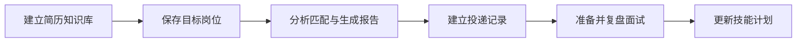

# 用户指南

## 账号与登录

1. 在登录页注册账号，或使用已有账号登录。
2. 浏览器保存服务端会话 Cookie；刷新页面后应用通过 `/api/auth/me` 恢复身份。
3. 如果管理员重置了密码，登录后必须先完成改密，才能进入工作台。
4. 使用共享设备后应点击退出。仅关闭页面不会主动撤销服务端会话。

用户名长度为 2–64 个字符，新密码长度为 8–128 个字符。连续登录失败会触发临时限流；请按界面或 `Retry-After` 指示稍后重试。

## 推荐使用流程

### 1. 建立知识库

- 上传 PDF、DOCX、TXT 或 Markdown 文件。文件必须在部署方配置的大小、PDF 页数、提取文本和分块上限内。
- 也可以输入公开的 HTTP/HTTPS 页面地址。系统会拒绝本机、私网、云 metadata 等内部目标，并限制重定向与响应体积。
- 知识库按账号隔离。状态页显示已索引分块数和来源；删除来源只影响当前账号。
- 文件上传完成表示文本已进入向量库，不表示系统保存了可下载的原始文件。

不要上传无权处理的个人信息、商业秘密或恶意文件。扫描版 PDF 若没有可提取文字，可能无法索引。

### 2. 管理简历与岗位

- 在“简历中心”（`/resumes`）保存标题、正文和目标岗位；可标记主要简历，同一账号最多有一个主要简历。
- 在“岗位库”（`/jobs`）保存职位、公司、JD、来源地址和 `saved`、`active`、`archived` 状态。
- 简历/岗位的结构化记录与 Chroma 知识库是两个数据面：删除其中一个不会自动删除另一个，除非使用“清空职业数据”。

### 3. 跟踪投递

在“投递工作台”（`/applications`）管理投递。每个投递必须关联一个自己的岗位，同一岗位最多有一条投递记录。可依次使用 `saved`、`applied`、`screening`、`interview`、`offer`、`rejected`、`withdrawn` 阶段，并记录下一步、截止日期和备注。删除岗位会同时删除其投递记录；已有面试历史会保留，但不再关联该岗位。

### 4. 模拟面试与复盘

- 在“面试中心”（`/interviews`）创建面试场次，可关联岗位，并使用 `planned`、`in_progress`、`completed` 或 `cancelled` 状态。
- 为场次添加问题，记录回答、顺序、0–100 分和反馈。
- 总分与单题分是辅助记录，不应被视为招聘结果或客观能力证明。
- 完成后可保存 `interview_review` 报告，并把薄弱项转成技能计划。

### 5. 报告与技能计划

“报告中心”（`/reports`）支持 `resume_analysis`、`job_match`、`interview_review` 和 `career_plan`。报告可以关联一个当前用户拥有的职业实体；结构化 `payload` 用于保存可复用结果，摘要用于快速阅读。payload 的 JSON UTF-8 编码最多 256 KiB。删除关联实体后，报告会作为历史快照保留。

“技能计划”（`/profile/skills`）可记录目标层级、状态、0–100 进度、到期日与备注；同名技能不能重复。进度由用户维护，系统不会根据聊天内容自动认定技能已完成。

## AI 对话与引用

发送消息后，前端通过 SSE token 协议显示内容。后端会先生成并审核完整回复，再开始发送已批准 token，因此复杂问题可能在首段文字出现前等待较久。回复完成时会返回消息 ID 和知识来源；只有完成事件到达后，回复才算成功保存。网络中断时可重试，客户端应复用同一个请求 ID 以避免重复生成。

当用户明确要求保存/记录，或 AI 高置信度识别到可执行职业信息时，回复下方可能出现“AI 添加建议”卡片。卡片最多三张，目标可以是简历、岗位、投递、面试、报告、技能或已有面试的题目批次。AI 不会直接写入这些业务表：用户应先检查内容和关联记录，可编辑并保存草稿，再点击“确认添加”。

- “忽略”会保留紧凑历史状态，之后可以恢复。
- 已确认建议不能撤销；需要修改或删除时前往对应职业板块操作。
- 投递、面试和面试题只允许关联当前账号已有记录。
- 面试题中的参考答案和辅导建议是 AI 示例，不代表用户真实回答、反馈或得分。
- 刷新和切换会话后，建议草稿与状态仍会保留。

更多边界见 [AI 职业数据建议](ai-suggestions.md)。

AI 回复可能不准确、过时或遗漏关键信息。投递材料、薪资、签证、劳动合同和职业决策应由用户核验；来源标记只表示检索到相关片段，不表示结论已经被事实验证。

可以对 AI 回复点赞或点踩，个人分析页会展示会话、消息、反馈和趋势统计。

## 导出、清空与退出

- 在技能计划页底部的“职业数据管理”中，“导出 JSON”会下载当前账号的简历、岗位、投递、面试（含问题）、报告、技能和 AI 职业建议。服务端会一次性在内存中组装全部数据；数据量很大时导出可能较慢或失败，此时请避免重复点击并联系部署方评估容量。
- “清空职业数据与知识库”要求输入大写 `DELETE`，会删除上述职业记录、AI 职业建议和当前用户的 Chroma 知识库。
- 清空不会删除账号、登录会话、聊天消息、反馈或管理员审计记录；当前版本也没有自助删除账号功能。需要处理这些数据时，请联系实际部署方。
- 清空不可通过界面撤销；部署方备份中可能仍有历史副本，恢复和保留规则由部署方决定。

## 常见问题

| 现象 | 建议 |
| --- | --- |
| 登录后立即要求改密 | 管理员已重置密码；按页面要求设置新密码 |
| 返回 403 | 刷新页面重新获取 CSRF；确认通过同一站点访问而非直连后端 |
| 返回 429 | 等待 `Retry-After` 指定时间，避免并发重复提交 |
| 职业/知识库操作返回 409 | 同一账号的数据操作正在串行执行；等待当前导出、写入或清空结束后重试 |
| 上传返回 400/413 | 检查扩展名、文件大小、PDF 页数或可提取文本量 |
| URL 导入失败 | 只使用公开 HTTP/HTTPS 页面；内部地址、过多跳转或过大页面会被拒绝 |
| 流式回复中断 | 保留当前会话并重试；如持续失败，请检查服务就绪状态或联系部署方 |
